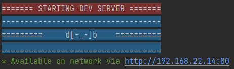

# qdds

> Quick Django Dev Server — start your local Django project with your IP exposed for LAN testing.

<p align="center">
  <a href="https://pypi.org/project/qdds/"></a>
  
  <a href="https://github.com/benmcnelly/qdds/issues"></a>
  <a href="https://pyup.io/repos/github/benmcnelly/qdds/"></a>
  <a href="https://www.youtube.com/watch?v=EIyixC9NsLI"></a>
</p>

---

## 🚀 What is qdds?

**qdds** (`devserver`) is a small CLI tool that runs your Django project's dev server using your local network IP, making it accessible to other devices on your Wi-Fi. Great for testing on mobile or with a team.

By default, it tries to bind to **port 80**, so other devices on your network can just enter your IP address (like `http://192.168.1.50`) without needing a port number. 🔥

If port 80 cannot be bound (due to permissions or port binding restrictions), it will automatically fall back to Django's default port **8000** so you don't have to think about it.



---

## 🛠 Installation

```bash
pip install qdds
```

---

## 📦 Usage

Inside your Django project folder (where `manage.py` lives):

```bash
devserver
```

This attempts to run:

```bash
python manage.py runserver 0.0.0.0:80
```

That means devices on your Wi-Fi can hit `http://<your-ip>` with no port required. If port 80 is restricted, it seamlessly uses port 8000 instead.

---

## 🔧 Options

- `--port <number>` — Explicitly set the port you want to use.
- `--localhost` — Run on localhost only instead of exposing to your local network (similar to default `manage.py runserver`).
- `--no-browser` — Start the server without automatically opening your browser.
- `--safe` — Legacy option to force port 8000 immediately.

---

## 🧪 Development

Clone and install in editable mode:

```bash
git clone https://github.com/benmcnelly/qdds.git
cd qdds
pip install -e .
```

Run tests:

```bash
pytest
```

---

## 💬 Why qdds?

Sometimes you just want to fire up Django on your LAN, show a teammate something on their phone, or test a layout in mobile Safari without thinking. qdds makes that effortless.

---

## 📝 License

MIT © Ben McNelly
